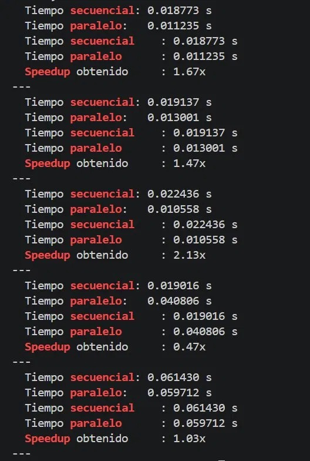
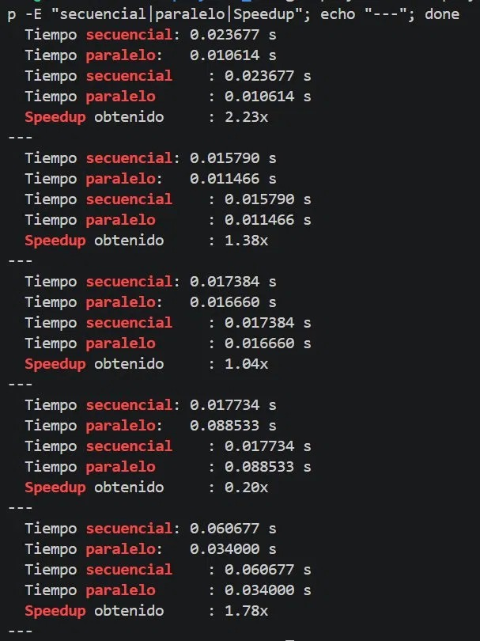
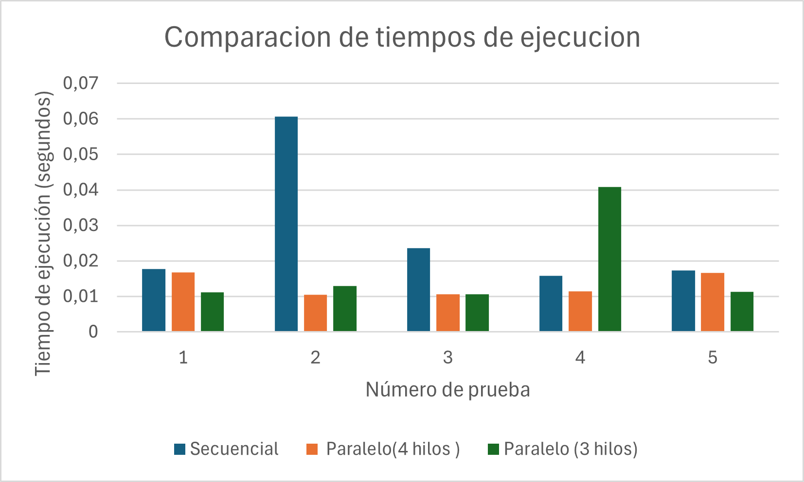
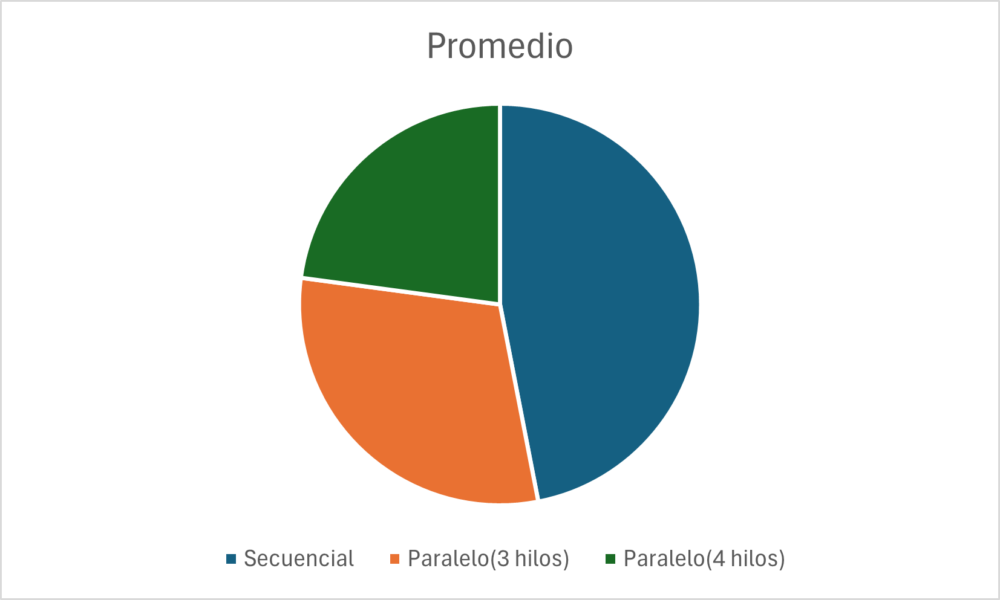

# [cite_start]Informe proyecto [cite: 1]
## [cite_start]Simulación y Procesamiento Paralelo de Transacciones de Ventas [cite: 2]

[cite_start]**Integrantes :** [cite: 3]
* [cite_start]Josue Palma [cite: 4]
* [cite_start]Miguel Molina [cite: 5]
* [cite_start]Nicolas Paspuel [cite: 6]
* [cite_start]Zenan Fernandez [cite: 7]
* [cite_start]Kevin Chushig [cite: 8]
* [cite_start]Deyvid Román [cite: 9]

[cite_start]**Sistemas Operativos** [cite: 10]
[cite_start]**Curso :** GR2CD [cite: 11]
[cite_start]**24 de mayo de 2026** [cite: 12]

---

### [cite_start]1. Introducción [cite: 13]
[cite_start]En el ámbito de los Sistemas Operativos modernos, la capacidad de ejecutar tareas de manera concurrente es fundamental para maximizar el uso de los recursos del procesador y reducir los tiempos de respuesta. [cite: 14] [cite_start]El presente proyecto tiene como finalidad implementar y analizar un programa en lenguaje C, ejecutado bajo un entorno de máquina virtual Ubuntu, capaz de procesar un volumen masivo de datos simulados. [cite: 15] [cite_start]Específicamente, el sistema procesa un conjunto de hasta 550,000 registros de transacciones de ventas. [cite: 16] [cite_start]A través de la comparación entre un enfoque de procesamiento secuencial y uno paralelo, empleando la biblioteca pthread.h, se busca demostrar empíricamente las ventajas del paralelismo en la manipulación y transformación de grandes volúmenes de información. [cite: 17]

### [cite_start]2. Objetivos [cite: 18]

#### 2.1. [cite_start]General [cite: 19]
[cite_start]Desarrollar un programa funcional en C, ejecutado en una máquina virtual Ubuntu, que procese en paralelo un conjunto de transacciones simuladas distribuyendo la carga de trabajo de manera eficiente. [cite: 20]

#### 2.2. [cite_start]Específicos: [cite: 21]
* [cite_start]Implementar el uso de hilos mediante la biblioteca POSIX ,pthread.h, para la ejecución concurrente de múltiples tareas. [cite: 22]
* [cite_start]Aplicar mecanismos de sincronización, específicamente semáforos de exclusión mutua , para proteger los recursos compartidos y prevenir condiciones de carrera durante la ejecución. [cite: 23]
* [cite_start]Ejecutar rutinas de limpieza, imputación de la moda y normalización Min-Max sobre miles de registros de ventas. [cite: 24]
* [cite_start]Medir, analizar y comparar de manera precisa los tiempos de ejecución entre el modo secuencial y el modo paralelo empleando la función clock_gettime(). [cite: 25]

---

### [cite_start]3. Diseño e Implementación del Sistema [cite: 26]

#### 3.1. [cite_start]Arquitectura del procesamiento de datos [cite: 27]
[cite_start]El sistema fue diseñado para leer y procesar un archivo CSV llamado transacciones.csv que contiene la información en crudo. [cite: 28] [cite_start]La lógica de procesamiento de datos se dividió en tres fases fundamentales aplicadas a cada bloque de transacciones: [cite: 29]
* [cite_start]**Limpieza de valores nulos numéricos:** Se identifican las cantidades con valores negativos y se ajustan a un valor base de 0.0. [cite: 30]
* [cite_start]**Imputación categórica:** Se reemplazan los valores de texto nulos o vacíos asignándoles la moda del conjunto de datos, la cual corresponde a la categoría "Alimentos". [cite: 31]
* [cite_start]**Normalización de datos:** Se aplica una transformación de escala Min-Max para llevar todas las cantidades a un rango estandarizado entre 0 y 1, facilitando su posterior uso analítico. [cite: 32]

#### [cite_start]Gestión de hilos y concurrencia [cite: 33]
[cite_start]Para evitar el procesamiento secuencial que genera cuellos de botella al iterar sobre los 550,000 registros, la carga se divide equitativamente. [cite: 34] [cite_start]Si el programa se ejecuta con N hilos, el arreglo global de transacciones se fragmenta en N bloques disjuntos. [cite: 35] [cite_start]Cada hilo de ejecución procesa su bloque asignado de forma independiente. [cite: 36] [cite_start]Dado que cada hilo opera sobre índices de memoria distintos dentro del arreglo global, las tres fases de transformación de datos que son la limpieza, imputación y normalización se ejecutan simultáneamente sin riesgo de solapamiento de datos. [cite: 37]

#### [cite_start]Mecanismos de sincronización [cite: 38]
[cite_start]Aunque la manipulación del arreglo es independiente por hilo, el acceso a la consola es un recurso compartido importante. [cite: 39] [cite_start]Para cumplir con los requerimientos de concurrencia y evitar condiciones de carrera al imprimir los tiempos de finalización de cada hilo, se implementó un cerrojo lógico mutex. [cite: 40] [cite_start]Mediante el uso de pthread_mutex_lock antes de ejecutar la función printf, y pthread_mutex_unlock inmediatamente después, el sistema garantiza que la escritura en la consola sea una operación atómica. [cite: 41] [cite_start]Esto asegura que los mensajes de los distintos hilos no se intercalen, permitiendo una lectura íntegra de los tiempos reportados para el análisis de rendimiento. [cite: 42]

---

### [cite_start]4. Análisis de rendimiento y resultados [cite: 43]
[cite_start]Para evaluar la eficiencia del sistema desarrollado, se realizaron múltiples pruebas empíricas ejecutando la limpieza, imputación y normalización de los registros. [cite: 44] [cite_start]Se comparó el rendimiento del algoritmo secuencial base frente al procesamiento paralelo utilizando 3 y 4 hilos. [cite: 45]

#### [cite_start]Tiempos de ejecución [cite: 46]
[cite_start]Se ejecutaron cinco rondas de pruebas para cada configuración con el fin de obtener una muestra representativa y minimizar el impacto de los procesos en segundo plano propios de la máquina virtual Ubuntu. [cite: 47]

| Prueba | Secuencial | Paralelo (3 hilos ) | Paralelo (4 hilos) |
|---|---|---|---|
| 1 | 0.017734 | 0.011235 | 0.016715 |
| 2 | 0.060677 | 0.013001 | 0.010441 |
| 3 | 0.023677 | 0.010558 | 0.010614 |
| 4 | 0.015790 | 0.040806 | 0.011466 |
| 5 | 0.017384 | 0.011327 | 0.016660 |

[cite_start]*(Tabla de tiempos de ejecución)* [cite: 48]

[cite_start]Para obtener una métrica de rendimiento estable, se calcularon los promedios de tiempo de ejecución de las cinco iteraciones y se determinó el factor de aceleración logrado por las configuraciones concurrentes en relación con la línea base secuencial. [cite: 49]

| Modo | Promedio | Speedup |
|---|---|---|
| Secuencial | 0.0270524 | linea base (1.00x) |
| Paralelo 3 hilos | 0.0173854 | 1.56 |
| Paralelo 4 hilos | 0.0131792 | 2.05 |

[cite_start]*(Tabla de métricas de rendimiento)* [cite: 50]

#### [cite_start]Análisis de fluctuaciones [cite: 51]
[cite_start]Durante la evaluación, específicamente en la Prueba 4 del modo con 3 hilos, se registró un pico en el tiempo de ejecución 0.040806 segundos. [cite: 52] [cite_start]Este tipo de variaciones es un comportamiento esperado al evaluar el rendimiento en un entorno virtualizado. [cite: 53] [cite_start]Al ejecutarse en una máquina virtual Ubuntu, el planificador de procesos del sistema maneja múltiples tareas simultáneamente, lo que ocasionó una demora temporal en la ejecución de los hilos del programa. [cite: 54]

#### [cite_start]Ejecución en Ubuntu [cite: 55]
[cite_start]A continuación, se presentan las evidencias de la terminal que demuestran la ejecución exitosa del programa y la correcta sincronización de los hilos en el sistema operativo huésped. [cite: 56]

> [cite_start]**Figura 1:** Pruebas realizadas de manera secuencial y paralela utilizando 3 hilos. [cite: 57] [cite_start]Se observa una clara reducción en el tiempo de procesamiento . [cite: 58]

> [cite_start]**Figura 2:** Pruebas realizadas de manera secuencial y paralela utilizando 4 hilos. [cite: 59] [cite_start]Esta configuración obtuvo el mejor rendimiento general y los menores tiempos de procesamiento. [cite: 60]

#### [cite_start]Comparación grafica [cite: 61]
[cite_start]Para una visualización más clara del impacto del paralelismo, se generaron los siguientes gráficos de barras que contrastan el rendimiento entre las tres modalidades ejecutadas: [cite: 62]

> [cite_start]**Figura 3:** Comparación de tiempos de ejecución en las cinco iteraciones de pruebas. [cite: 63]

> [cite_start]**Figura 4:** Promedio global de tiempos de ejecución por método de procesamiento. [cite: 64]

---

### [cite_start]5. Conclusiones [cite: 65]
* [cite_start]**Eficiencia del Procesamiento Concurrente:** La implementación de hilos mediante pthread.h demostró una superioridad técnica indiscutible frente al procesamiento secuencial. [cite: 66] [cite_start]Al dividir el arreglo de datos en bloques independientes, se logró que el procesador distribuyera mejor la carga de trabajo, ejecutando las transformaciones de datos mucho más rápido. [cite: 67]
* [cite_start]**Impacto de la Asignación de Hilos:** Se comprobó que el rendimiento mejora al incrementar la cantidad de hilos dentro de los parámetros probados. [cite: 68] [cite_start]La configuración con 4 hilos obtuvo el mayor grado de eficiencia, logrando reducir el tiempo promedio de ejecución. [cite: 69]
* [cite_start]**Estabilidad del Sistema:** A lo largo de la repetición de las pruebas, el programa mantuvo un alto nivel de estabilidad y consistencia en sus resultados. [cite: 70] [cite_start]El uso adecuado de exclusión mutua en las zonas críticas garantizó una impresión ordenada por consola sin generar bloqueos ni afectar el flujo del algoritmo. [cite: 71]
* [cite_start]**Comportamiento Esperado en Máquinas Virtuales:** Se evidenció la presencia de fluctuaciones menores en los tiempos de respuesta debido a la gestión concurrente de recursos de la propia máquina virtual Ubuntu. [cite: 72] [cite_start]Sin embargo, estas alteraciones no modificaron las tendencias generales obtenidas. [cite: 73]